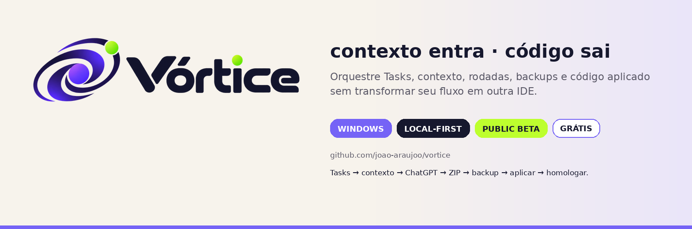
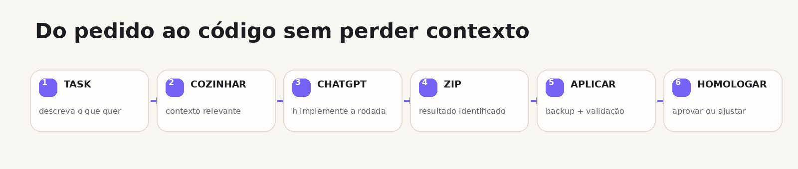
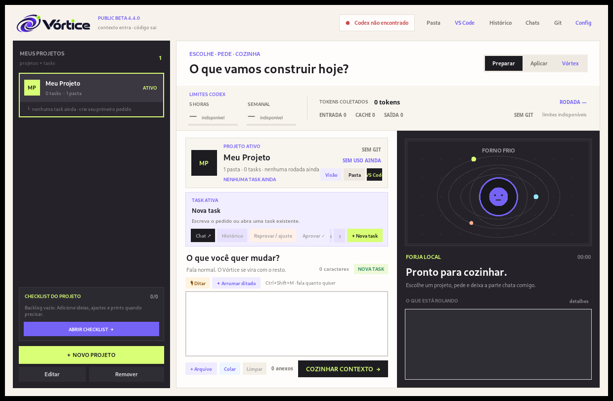
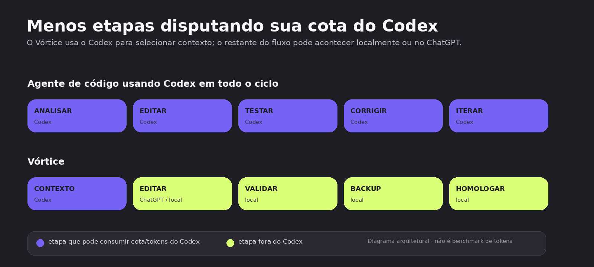

<p align="center">
  
</p>

<p align="center">
  <a href="https://github.com/joao-araujoo/vortice/releases/latest/download/Vortice-Setup.exe"></a>
  <a href="https://github.com/joao-araujoo/vortice/releases/latest/download/Vortice-Portable.zip"></a>
</p>

<p align="center">
  <a href="https://github.com/joao-araujoo/vortice/releases/latest"></a>
  
  
  <a href="LICENSE"></a>
</p>

<p align="center"><b>Projeto → Checklist → Task → Rodadas → Contexto → ChatGPT → ZIP → Backup → Aplicar → Homologar.</b></p>

O **Vórtice** é um orquestrador desktop para desenvolvimento. Ele não tenta substituir seu editor, Git ou ChatGPT: organiza o caminho entre eles para você conseguir trabalhar em Tasks sem ficar montando ZIP, repetindo contexto, caçando arquivos e lembrando onde parou.

> **Public Beta 4.4.0.** Gratuito, local-first e feito para Windows.

---

## ✦ Como ele funciona

<p align="center">
  
</p>

1. **Crie ou abra uma Task.** Cada Task mantém seu próprio prompt, anexos, rodadas, histórico e chat do Vórtex.
2. **COZINHAR CONTEXTO.** O Vórtice pede ao Codex CLI apenas a seleção do contexto relevante e monta `CONTEXTO.zip`.
3. **MANDAR PRO GPT.** O pacote, prompt e anexos ficam prontos para o handoff ao ChatGPT.
4. **Receba o ZIP final.** Cada rodada possui identidade própria (`RESULT_TOKEN`) para reduzir risco de aplicar o resultado errado.
5. **Aplicar com segurança.** Backup, validações locais e preview acontecem antes de mexer no projeto.
6. **Homologue.** Aprove a Task ou reprove e abra a próxima rodada mantendo todo o histórico.

<p align="center">
  
</p>

---

## 🌀 O que já vem dentro

- **Projetos com múltiplas raízes** — frontend, backend, app e outras pastas no mesmo projeto.
- **Tasks + Rodadas** — pare de usar “branch” como sinônimo de tarefa; cada tentativa fica preservada.
- **Checklist de desenvolvimento** — backlog por projeto com notas, prints e arquivos; um item pode virar Task.
- **Vórtex** — agente/mascote ligado à Task atual, com chat separado, backup e rollback para ações explícitas.
- **Skills globais e por projeto** — Markdown/TXT para design system, regras técnicas, convenções e contexto recorrente.
- **Ditado por voz** — use a digitação por voz do Windows e um glossário local por projeto.
- **Histórico e timeline** — prompt, contexto, ZIP, aplicação, ajustes, homologação e pontos de recuperação.
- **Backups de código** — restaure um ponto seguro sem procurar arquivos manualmente.
- **Git** — visão rápida e checkpoints locais sem transformar o Vórtice em uma IDE.
- **Notificações, sons e Vórtex animado** — sim, ele faz barulho quando termina porque esquecer que a Task acabou é um problema real. 😭
- **Validações locais** — caminhos suspeitos, arquivos sensíveis e incoerências óbvias podem ser bloqueados antes da aplicação.
- **Memória local do projeto** — frameworks, raízes, docs, notas e glossário sem chamada extra de IA.

---

## 🧠 Economia da cota do Codex

A filosofia do Vórtice é simples: **não gastar Codex com trabalho que pode acontecer localmente ou no ChatGPT que você já usa**.

<p align="center">
  
</p>

No fluxo padrão, o Codex pode ficar concentrado na etapa de **seleção/análise do contexto**. Backups, histórico, validação de ZIP, memória do projeto, organização de rodadas, ditado local e aplicação são feitos localmente.

> **Importante:** o gráfico acima é arquitetural, não um benchmark de tokens. A economia real depende do projeto, do tamanho do contexto, do modelo, do tipo de Task e de quanto você usa o Vórtex/Codex explicitamente. O Vórtice não promete uma porcentagem fixa de economia.

---

## ⬇ Instalação

### Opção recomendada — Setup

Baixe **[Vortice-Setup.exe](https://github.com/joao-araujoo/vortice/releases/latest/download/Vortice-Setup.exe)** na página de Releases e siga o instalador.

- Windows 10/11 x64.
- Não exige Python instalado quando você usa o build de Release.
- Dados do usuário ficam em `%LOCALAPPDATA%\Vortice`.
- Git e VS Code são opcionais.
- Para **COZINHAR CONTEXTO**, instale e autentique o **Codex CLI oficial**.

### Portátil

Baixe **[Vortice-Portable.zip](https://github.com/joao-araujoo/vortice/releases/latest/download/Vortice-Portable.zip)**, extraia em qualquer pasta e execute `Vortice.exe`.

Também publicamos `SHA256SUMS.txt` em cada Release para você conferir os arquivos baixados.

---

## 🌐 Handoff público com ChatGPT

A edição pública usa **fluxo assistido** no ChatGPT Web: o Vórtice prepara o prompt, `CONTEXTO.zip` e anexos, abre o handoff e mantém toda a organização local; você confirma o envio e devolve o ZIP final ao Vórtice.

A distribuição pública **não inclui uma extensão que extraia/baixe automaticamente respostas do ChatGPT Web**. Isso deixa o pacote público mais previsível e evita depender de automação frágil da interface de um serviço externo.

O Vórtice é um projeto independente e **não é afiliado, patrocinado ou endossado pela OpenAI**. ChatGPT, GPT e Codex são marcas da OpenAI.

---

## 🔒 Privacidade e segurança

O Vórtice é **local-first** e não possui telemetria própria nesta versão.

- Projetos e histórico ficam no seu computador.
- O app bloqueia padrões comuns de segredo como `.env`, chaves privadas e credenciais ao montar contexto.
- Backups ficam locais.
- Você decide o que enviar ao ChatGPT.
- Skills e memória do projeto são arquivos locais.

Leia **[PRIVACY.md](PRIVACY.md)** e **[SECURITY.md](SECURITY.md)** antes de usar em repositórios sensíveis.

---

## 🛠 Desenvolvimento

Clone o projeto e execute:

```powershell
TEST.bat
START.bat
```

Para gerar um build local de desenvolvimento:

```powershell
BUILD-EXE.bat
```

A Release pública usa **GitHub Actions + PyInstaller onedir + Inno Setup**. Isso gera um instalador e um ZIP portátil em uma máquina Windows limpa do GitHub.

Para publicar uma nova versão na sua própria conta/repositório, veja **[PUBLISHING.md](PUBLISHING.md)**.

---

## 🗺 Próximos passos

A direção do projeto continua sendo **mais inteligência por baixo, menos cliques por cima**. Algumas ideias que combinam com essa filosofia:

- IA local opcional para tarefas pequenas e realmente “infinita” no uso local;
- mais validadores locais que não gastem tokens;
- instalador/atualizador ainda mais transparente;
- suporte a mais fluxos sem transformar o Vórtice em IDE.

---

## 🤝 Contribuindo

Bugou de um jeito criativo? Tem uma melhoria que reduz cliques ou evita cagada? Abra uma **Issue**.

Pull Requests também são bem-vindos. Veja **[CONTRIBUTING.md](CONTRIBUTING.md)**.

---

<p align="center">
  <b>Vórtice</b><br>
  <sub>Fala normal. O Vórtice se vira com o resto.</sub>
</p>
